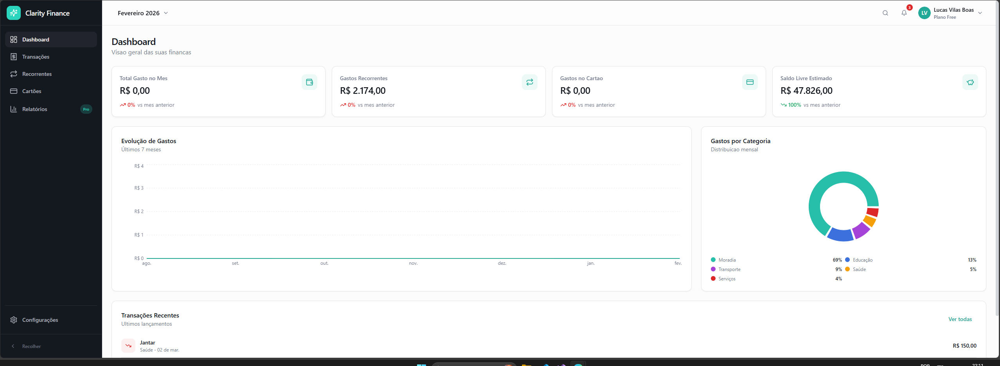

# 💰 Clarity Finance

> A web application for personal finance management with Google authentication and real-time persistence on Firebase.

[Portuguese version here](README.pt-br.md)




---

## ✨ Features

- 🔐 **Google Sign-In** via Firebase Auth
- 📊 **Dashboard** with consolidated financial indicators
- 💸 **Transactions** — create, list, edit, and delete with monthly filtering
- 🔁 **Recurring expenses** — manage your fixed costs
- 🛡️ **Protected routes** with authentication guards
- 📈 **Interactive charts** powered by Recharts

---

## 🛠️ Tech Stack

| Category | Technology |
|---|---|
| Frontend | React 18 + TypeScript |
| Build tool | Vite |
| Styling | Tailwind CSS + shadcn/ui |
| Authentication | Firebase Auth (Google) |
| Database | Cloud Firestore |
| Routing | React Router |
| Charts | Recharts |
| Testing | Vitest |

---

## 🚀 Running locally

### Prerequisites

- Node.js 18+
- npm 9+
- Firebase project with **Authentication** and **Firestore** enabled

### Step by step

**1. Clone the repository**

```bash
git clone https://github.com/VilasBoas1407/clarity-finance.git
cd clarity-finance
```

**2. Install dependencies**

```bash
npm install
```

**3. Set up environment variables**

Copy the example file and fill in your Firebase project credentials:

```bash
cp .env.example .env
```

| Variable | Description |
|---|---|
| `VITE_FIREBASE_API_KEY` | Firebase API key |
| `VITE_FIREBASE_AUTH_DOMAIN` | Authentication domain |
| `VITE_FIREBASE_PROJECT_ID` | Project ID |
| `VITE_FIREBASE_STORAGE_BUCKET` | Storage bucket |
| `VITE_FIREBASE_MESSAGING_SENDER_ID` | Messaging sender ID |
| `VITE_FIREBASE_APP_ID` | App ID |
| `VITE_FIREBASE_MEASUREMENT_ID` | Analytics measurement ID (optional) |

**4. Start the development server**

```bash
npm run dev
```

Open `http://localhost:5173` in your browser.

---

## 📜 Available scripts

```bash
npm run dev          # Development server
npm run build        # Production build
npm run preview      # Preview the production build
npm run lint         # Static code analysis
npm run test         # Run tests (Vitest)
npm run test:watch   # Run tests in watch mode
```

---

## 🗂️ Firestore data structure

Data is organized per authenticated user:

```
users/
└── {uid}/
    ├── (user document)
    ├── transactions/
    │   └── {transactionId}
    └── recurringExpenses/
        └── {expenseId}
```

### `transaction` fields

| Field | Type | Description |
|---|---|---|
| `description` | string | Transaction description |
| `category` | string | Category (e.g., food, health) |
| `amount` | number | Amount |
| `type` | string | `income` or `expense` |
| `paymentMethod` | string | Payment method |
| `date` | timestamp | Transaction date |
| `yearMonth` | string | Format `YYYY-MM` — used for monthly filtering |
| `createdAt` | timestamp | Creation date |
| `updatedAt` | timestamp | Last updated date |
| `userId` | string | Owner's UID |

> ⚠️ The `yearMonth` field is required for a transaction to appear in the dashboard's monthly filter.

---

## 🗺️ Application routes

| Route | Description |
|---|---|
| `/` | Landing page |
| `/login` | Login page |
| `/dashboard` | Main dashboard |
| `/transactions` | Transaction list and management |
| `/recurring` | Recurring expenses |
| `/cards` | Cards |
| `/reports` | Reports |
| `/settings` | Settings |

---

## 🔒 Firestore security rules

Apply the rules below in your Firebase console to ensure each user can only access their own data:

```
rules_version = '2';
service cloud.firestore {
  match /databases/{database}/documents {
    match /users/{userId} {
      allow read, create, update, delete: if request.auth != null
                                         && request.auth.uid == userId;

      match /transactions/{transactionId} {
        allow read, create, update, delete: if request.auth != null
                                           && request.auth.uid == userId;
      }

      match /recurringExpenses/{expenseId} {
        allow read, create, update, delete: if request.auth != null
                                           && request.auth.uid == userId;
      }
    }
  }
}
```

> ❌ If you get a `Missing or insufficient permissions` error, make sure the rules above are correctly applied in your Firebase project.

---

## 📄 License

This project is licensed under the MIT License.