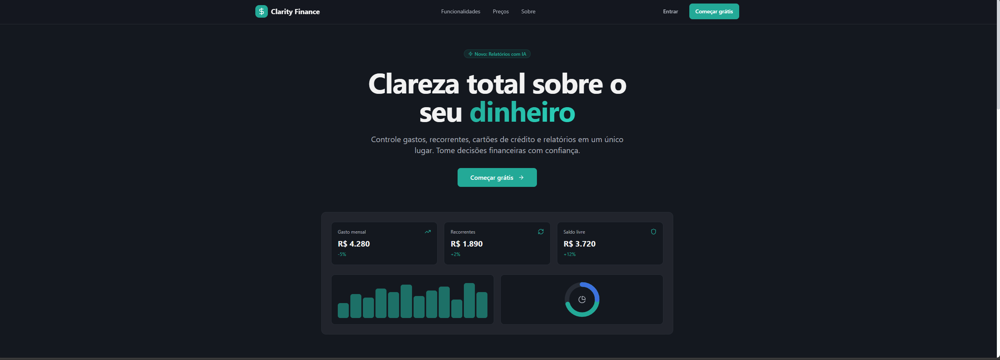

# 💰 Clarity Finance

> Aplicação web para controle financeiro pessoal com autenticação Google e persistência em tempo real no Firebase.



---

## ✨ Funcionalidades

- 🔐 **Login com Google** via Firebase Auth
- 📊 **Dashboard** com indicadores financeiros consolidados
- 💸 **Transações** — cadastro, listagem, edição e exclusão com filtro mensal
- 🔁 **Gastos recorrentes** — gestão de despesas fixas
- 🛡️ **Rotas protegidas** por autenticação
- 📈 **Gráficos** interativos com Recharts

---

## 🛠️ Stack

| Categoria | Tecnologia |
|---|---|
| Frontend | React 18 + TypeScript |
| Build | Vite |
| Estilização | Tailwind CSS + shadcn/ui |
| Autenticação | Firebase Auth (Google) |
| Banco de dados | Cloud Firestore |
| Roteamento | React Router |
| Gráficos | Recharts |
| Testes | Vitest |

---

## 🚀 Como rodar localmente

### Pré-requisitos

- Node.js 18+
- npm 9+
- Projeto Firebase com **Authentication** e **Firestore** habilitados

### Passo a passo

**1. Clone o repositório**

```bash
git clone https://github.com/VilasBoas1407/clarity-finance.git
cd clarity-finance
```

**2. Instale as dependências**

```bash
npm install
```

**3. Configure as variáveis de ambiente**

Copie o arquivo de exemplo e preencha com as credenciais do seu projeto Firebase:

```bash
cp .env.example .env
```

| Variável | Descrição |
|---|---|
| `VITE_FIREBASE_API_KEY` | Chave de API do Firebase |
| `VITE_FIREBASE_AUTH_DOMAIN` | Domínio de autenticação |
| `VITE_FIREBASE_PROJECT_ID` | ID do projeto |
| `VITE_FIREBASE_STORAGE_BUCKET` | Bucket de storage |
| `VITE_FIREBASE_MESSAGING_SENDER_ID` | ID do sender |
| `VITE_FIREBASE_APP_ID` | ID do app |
| `VITE_FIREBASE_MEASUREMENT_ID` | ID de analytics (opcional) |

**4. Inicie o servidor de desenvolvimento**

```bash
npm run dev
```

Acesse `http://localhost:5173` no seu navegador.

---

## 📜 Scripts disponíveis

```bash
npm run dev          # Servidor de desenvolvimento
npm run build        # Build de produção
npm run preview      # Preview do build gerado
npm run lint         # Análise estática de código
npm run test         # Executa os testes (Vitest)
npm run test:watch   # Testes em modo watch
```

---

## 🗂️ Estrutura de dados (Firestore)

Os dados são organizados por usuário autenticado:

```
users/
└── {uid}/
    ├── (documento do usuário)
    ├── transactions/
    │   └── {transactionId}
    └── recurringExpenses/
        └── {expenseId}
```

### Campos de uma `transaction`

| Campo | Tipo | Descrição |
|---|---|---|
| `description` | string | Descrição da transação |
| `category` | string | Categoria (ex: alimentação, saúde) |
| `amount` | number | Valor |
| `type` | string | `income` ou `expense` |
| `paymentMethod` | string | Método de pagamento |
| `date` | timestamp | Data da transação |
| `yearMonth` | string | Formato `YYYY-MM` — usado para filtro mensal |
| `createdAt` | timestamp | Data de criação |
| `updatedAt` | timestamp | Última atualização |
| `userId` | string | UID do usuário dono |

> ⚠️ O campo `yearMonth` é obrigatório para que a transação apareça no filtro mensal do dashboard.

---

## 🗺️ Rotas da aplicação

| Rota | Descrição |
|---|---|
| `/` | Landing page |
| `/login` | Página de login |
| `/dashboard` | Dashboard principal |
| `/transactions` | Listagem e gestão de transações |
| `/recurring` | Gastos recorrentes |
| `/cards` | Cartões |
| `/reports` | Relatórios |
| `/settings` | Configurações |

---

## 🔒 Regras de segurança (Firestore)

Configure as regras abaixo no console do Firebase para garantir que cada usuário acesse apenas seus próprios dados:

```
rules_version = '2';
service cloud.firestore {
  match /databases/{database}/documents {
    match /users/{userId} {
      allow read, create, update, delete: if request.auth != null
                                         && request.auth.uid == userId;

      match /transactions/{transactionId} {
        allow read, create, update, delete: if request.auth != null
                                           && request.auth.uid == userId;
      }

      match /recurringExpenses/{expenseId} {
        allow read, create, update, delete: if request.auth != null
                                           && request.auth.uid == userId;
      }
    }
  }
}
```

> ❌ Se você receber o erro `Missing or insufficient permissions`, verifique se as regras acima estão aplicadas corretamente no seu projeto Firebase.

---

## 📄 Licença

Este projeto está sob a licença MIT.